# Deposit Flow Review

## Reviewed Flow Path

1. `depositERC20(...)`
2. `depositERC20To(...)`
3. `_initiateERC20Deposit(...)`
4. `_initiateBridgeERC20(...)`
5. `messenger.sendMessage(...)`
6. `L1 -> L2` messenger delivery segment
7. `finalizeBridgeERC20(...)`

## Deposit Flow Diagram

```mermaid
flowchart LR
    A["User calls depositERC20 / depositERC20To"] --> B["_initiateERC20Deposit(...)"]
    B --> C["_initiateBridgeERC20(...) on L1"]
    C --> D["ordinary L1 token branch"]
    D --> E["lock token / update deposits accounting"]
    E --> F["messenger.sendMessage(...)"]
    F --> G["L1 -> L2 message delivery segment"]
    G --> H["finalizeBridgeERC20(...) on L2"]
    H --> I["mintable L2 token branch"]
    I --> J["mint representation token to recipient"]
```

## L1 -> L2 Messenger Delivery Segment

The `L1 -> L2` delivery segment is part of end-to-end path continuity, but this review treats it as a bridge/application-layer boundary rather than as a standalone infra deep-dive.

The main review target remains:

- whether the bridge prepares the message correctly;
- whether the destination-side finalize path assumes the correct caller and token semantics;
- whether source-side accounting is completed before remote-side credit is possible.

## Deposit Flow Invariants

- `[x]` source-side accounting must complete before sending the `L1 -> L2` message
- `[x]` standard ordinary-token deposit path must follow `lock -> message -> mint`
- `[x]` destination-side finalize must not complete deposit credit without `counterpart bridge` authorization
- `[x]` `local/remote token semantics` must be reversed when moving into the remote-side `finalize` context
- `[x]` destination-side `mint` path must operate only for the correct `L1/L2 token pair`
- `[x]` deposit flow must preserve declared sender/recipient semantics from entrypoint to finalize
- `[x]` destination-side completion for a `representation token` must occur through `mint`, not `release existing tokens`

## Transport Boundary

The transport layer is relevant here only as a continuity boundary. This review does not attempt to prove the full messenger system. Instead, it verifies that the bridge/application layer:

- hands off only after correct source-side accounting;
- targets the correct counterpart bridge;
- encodes the `finalize` payload in the correct remote-side context.

## Deposit Flow Conclusion

The standard ERC20 deposit path preserves a clean lifecycle:

- `L1 original token` is locked;
- the bridge emits and sends a counterpart-targeted message;
- on `L2`, the correct representation token is credited through `mint`.

The path remains sound as long as counterpart assumptions, pair correctness, and pause/config surface remain intact.
