# Withdraw Flow Review

## Reviewed Flow Path

1. `withdraw(...)`
2. `_initiateWithdrawal(...)`
3. `_initiateBridgeERC20(...)`
4. `messenger.sendMessage(...)`
5. `L2 -> L1` messenger / portal delivery segment
6. `finalizeERC20Withdrawal(...)`
7. `finalizeBridgeERC20(...)`

## Withdraw Flow Diagram

```mermaid
flowchart LR
    A["User calls withdraw(...)"] --> B["_initiateWithdrawal(...)"]
    B --> C["resolve L1 pair from L2 representation token"]
    C --> D["_initiateBridgeERC20(...) on L2"]
    D --> E["mintable L2 token branch"]
    E --> F["burn representation token"]
    F --> G["messenger.sendMessage(...)"]
    G --> H["L2 -> L1 delivery segment"]
    H --> I["finalizeERC20Withdrawal(...)"]
    I --> J["finalizeBridgeERC20(...) on L1"]
    J --> K["ordinary L1 token branch"]
    K --> L["deposits -= amount"]
    L --> M["release original token to recipient"]
```

## L2 -> L1 Messenger / Portal Delivery Segment

The `L2 -> L1` delivery segment is part of end-to-end lifecycle continuity, but it is treated here as a transport boundary rather than as a standalone infra audit.

This review focuses on whether the bridge layer:

- constructs the correct handoff message;
- targets the correct counterpart bridge;
- expects the correct `L1 finalize` semantics after the message is relayed.

## Withdraw Flow Invariants

- `[x]` standard `ERC20 withdraw flow` must follow `burn -> message -> release`
- `[x]` `source-side withdraw path` must not `release` the original token locally before remote-side finalize
- `[x]` `L2 -> L1 message` must be directed only to the `counterpart bridge`
- `[x]` `local/remote token semantics` must be reversed when moving into the remote-side `finalize` context
- `[x]` `withdraw finalize path` must `release` an already-existing locked original token, not `mint` a new one
- `[x]` standard `ERC20 withdraw flow` must start from `L2 representation-token semantics`, not from an arbitrary ordinary `L2 ERC20`

## Transport Boundary

The transport segment remains out of primary scope. The review validates only that the application-layer bridge logic:

- performs the correct source-side accounting step first;
- hands off to the configured counterpart bridge;
- preserves correct token semantics across the remote-side context switch.

## Withdraw Flow Conclusion

The standard ERC20 withdraw path preserves the opposite side of the bridge lifecycle:

- `L2 representation token` is burned;
- the bridge sends a counterpart-targeted message;
- on `L1`, already-locked original tokens are released to the recipient.

This keeps withdraw behavior symmetrical with deposit while preserving the original-vs-representation accounting split.
